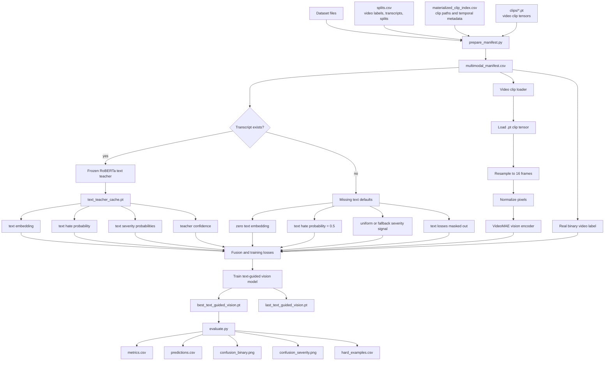
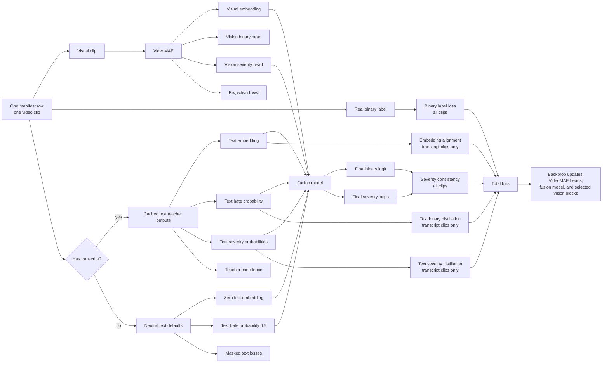
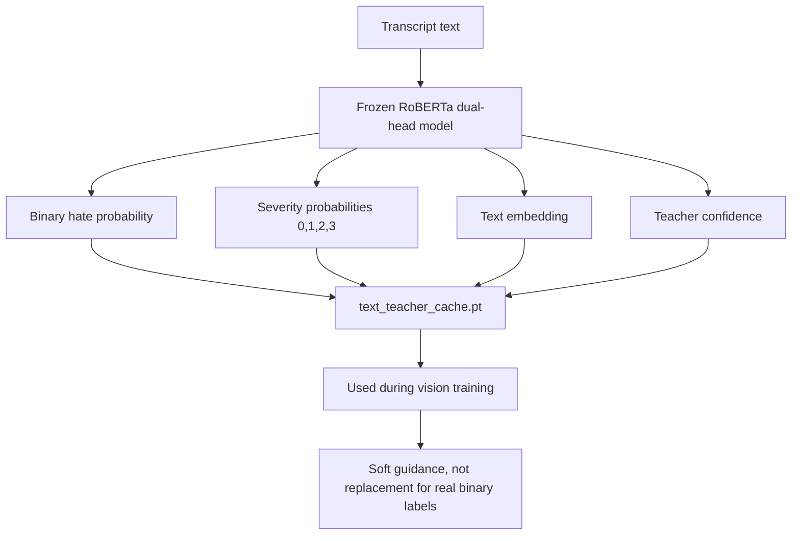
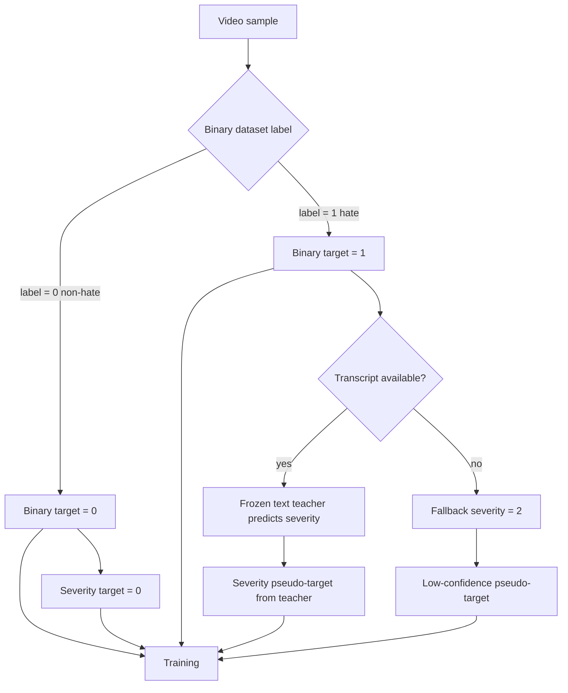
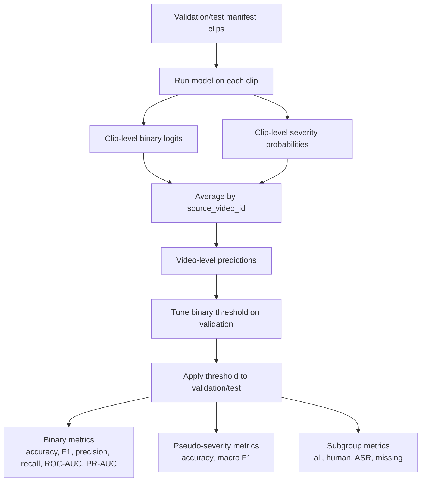
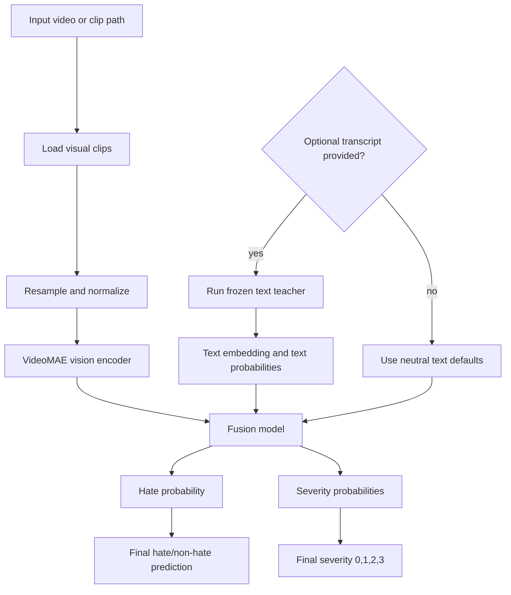

# Text-Guided Vision Classifier Flow

## Full Pipeline

```mermaid
flowchart TD
    A[Dataset files] --> B[prepare_manifest.py]
    A1[splits.csv<br/>video labels, transcripts, splits] --> B
    A2[materialized_clip_index.csv<br/>clip paths and temporal metadata] --> B
    A3[clips/*.pt<br/>video clip tensors] --> B

    B --> C[multimodal_manifest.csv]

    C --> D{Transcript exists?}

    D -- yes --> E[Frozen RoBERTa text teacher]
    E --> F[text_teacher_cache.pt]
    F --> F1[text embedding]
    F --> F2[text hate probability]
    F --> F3[text severity probabilities]
    F --> F4[teacher confidence]

    D -- no --> G[Missing text defaults]
    G --> G1[zero text embedding]
    G --> G2[text hate probability = 0.5]
    G --> G3[uniform or fallback severity signal]
    G --> G4[text losses masked out]

    C --> H[Video clip loader]
    H --> I[Load .pt clip tensor]
    I --> J[Resample to 16 frames]
    J --> K[Normalize pixels]
    K --> L[VideoMAE vision encoder]

    F1 --> M[Fusion and training losses]
    F2 --> M
    F3 --> M
    F4 --> M
    G1 --> M
    G2 --> M
    G3 --> M
    G4 --> M
    L --> M

    C --> N[Real binary video label]
    N --> M

    M --> O[Train text-guided vision model]
    O --> P[best_text_guided_vision.pt]
    O --> Q[last_text_guided_vision.pt]

    P --> R[evaluate.py]
    R --> S[metrics.csv]
    R --> T[predictions.csv]
    R --> U[confusion_binary.png]
    R --> V[confusion_severity.png]
    R --> W[hard_examples.csv]
```

## Training Data Flow

```mermaid
flowchart LR
    A[One manifest row<br/>one video clip] --> B[Visual clip]
    A --> C[Real binary label]
    A --> D{Has transcript?}

    B --> E[VideoMAE]
    E --> F[Visual embedding]
    E --> G[Vision binary head]
    E --> H[Vision severity head]
    E --> I[Projection head]

    D -- yes --> J[Cached text teacher outputs]
    J --> J1[Text embedding]
    J --> J2[Text hate probability]
    J --> J3[Text severity probabilities]
    J --> J4[Teacher confidence]

    D -- no --> K[Neutral text defaults]
    K --> K1[Zero text embedding]
    K --> K2[Text hate probability 0.5]
    K --> K3[Masked text losses]

    F --> L[Fusion model]
    H --> L
    J1 --> L
    J2 --> L
    J3 --> L
    K1 --> L
    K2 --> L

    L --> M[Final binary logit]
    L --> N[Final severity logits]

    C --> O[Binary label loss<br/>all clips]
    J2 --> P[Text binary distillation<br/>transcript clips only]
    J3 --> Q[Text severity distillation<br/>transcript clips only]
    J1 --> R[Embedding alignment<br/>transcript clips only]
    M --> S[Severity consistency<br/>all clips]
    N --> S

    O --> T[Total loss]
    P --> T
    Q --> T
    R --> T
    S --> T
    T --> U[Backprop updates VideoMAE heads,<br/>fusion model, and selected vision blocks]
```

## What The Text Teacher Does

```mermaid
flowchart TD
    A[Transcript text] --> B[Frozen RoBERTa dual-head model]
    B --> C[Binary hate probability]
    B --> D[Severity probabilities 0,1,2,3]
    B --> E[Text embedding]
    B --> F[Teacher confidence]

    C --> G[text_teacher_cache.pt]
    D --> G
    E --> G
    F --> G

    G --> H[Used during vision training]
    H --> I[Soft guidance, not replacement for real binary labels]
```

## Label And Severity Logic

```mermaid
flowchart TD
    A[Video sample] --> B{Binary dataset label}

    B -- label = 0 non-hate --> C[Binary target = 0]
    C --> D[Severity target = 0]

    B -- label = 1 hate --> E[Binary target = 1]
    E --> F{Transcript available?}

    F -- yes --> G[Frozen text teacher predicts severity]
    G --> H[Severity pseudo-target from teacher]

    F -- no --> I[Fallback severity = 2]
    I --> J[Low-confidence pseudo-target]

    C --> K[Training]
    D --> K
    E --> K
    H --> K
    J --> K
```

## Evaluation Flow

```mermaid
flowchart TD
    A[Validation/test manifest clips] --> B[Run model on each clip]
    B --> C[Clip-level binary logits]
    B --> D[Clip-level severity probabilities]

    C --> E[Average by source_video_id]
    D --> E

    E --> F[Video-level predictions]
    F --> G[Tune binary threshold on validation]
    G --> H[Apply threshold to validation/test]

    H --> I[Binary metrics<br/>accuracy, F1, precision, recall, ROC-AUC, PR-AUC]
    H --> J[Pseudo-severity metrics<br/>accuracy, macro F1]
    H --> K[Subgroup metrics<br/>all, human, ASR, missing]
```

## Inference Flow

```mermaid
flowchart TD
    A[Input video or clip path] --> B[Load visual clips]
    B --> C[Resample and normalize]
    C --> D[VideoMAE vision encoder]

    E{Optional transcript provided?} -- yes --> F[Run frozen text teacher]
    F --> G[Text embedding and text probabilities]

    E -- no --> H[Use neutral text defaults]

    D --> I[Fusion model]
    G --> I
    H --> I

    I --> J[Hate probability]
    I --> K[Severity probabilities]
    J --> L[Final hate/non-hate prediction]
    K --> M[Final severity 0,1,2,3]
```

