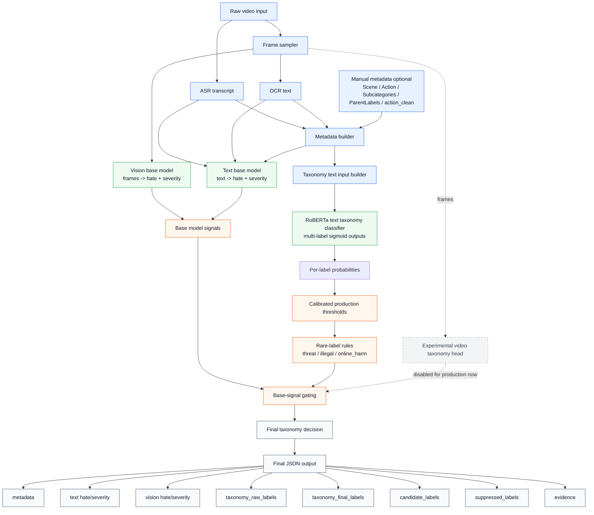
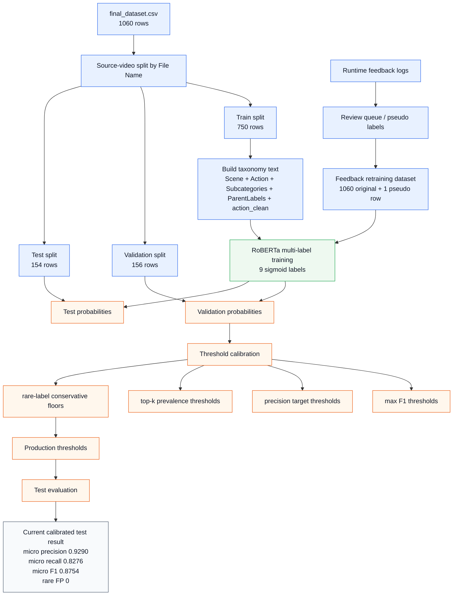

# Taxonomy Moderation Architecture Diagram

This diagram shows the current recommended production architecture. The taxonomy labels come from the text transformer model. The text and vision base models provide hate/severity gating and calibration signals.



## Training And Calibration Flow



## Current Production Recommendation

```text
Use:
  RoBERTa text taxonomy classifier
  + calibrated thresholds
  + rare-label rules
  + text hate/severity base model
  + vision hate/severity base model

Do not use as final taxonomy source yet:
  video taxonomy head

Reason:
  video taxonomy currently has incomplete frame coverage and unstable rare-label behavior.
```

